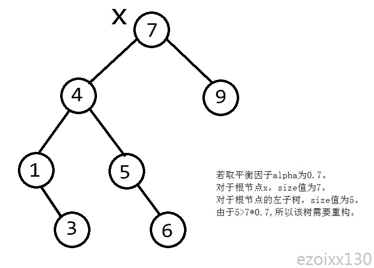
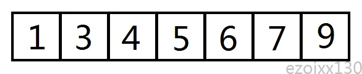
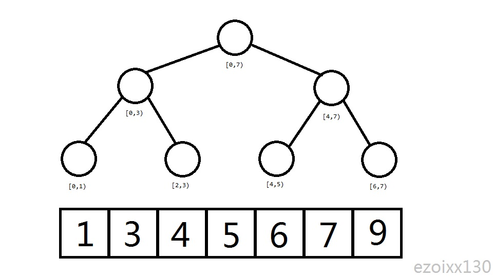

# 替罪羊树

## 介绍

在众多的平衡树之中，大部分依赖旋转（单旋或双旋）来维持平衡，但是有一些平衡树是不依赖于旋转操作。替罪羊树便是其中一种。

替罪羊树基于一种**暴力重构**的操作来保证平衡，具体来说，就是定义一个平衡因子$alpha$，当某个节点x的某棵子树的$x.ch.size>x.size*alpha$\*时便将这棵以x为根的子树拍扁重构。


  

一个需要重构的例子


## 重构方法

重构的目的是让该子树将变得平衡，那么如何进行重构使得该树变得平衡呢？

具体方法是：

1、将该树拍扁，存入数组或者vector中。


  

拍扁后的样子


2、重新建树（每次取区间中点作为根，然后递归两边为左右子树建树）


  

建树过程


# 时间复杂度分析

这样重构一次的时间复杂度为$O(n)$（n为子树大小），但是实际上替罪羊树的单次插入时间复杂度并不会达到$O(nlogn)$，因为一个$size=t$的子树需要插入$Ω(t)$个点才会被重构，所以可以通过势能分析来证明替罪羊树的单次操作的均摊时间复杂度为$O(logn)$，具体证明这里不详细展开。


## 经典操作

下面来看插入和删除操作：

插入：

插入操作和普通二叉搜索树无大异，唯一不同的是，在递归返回时需要判断该子树是否需要重构。

删除：

这里的删除不是真正意义上的删除，而是给要删除的点打一个标记，在该节点需要被重构时删除掉。

rank和kth操作也无大差别。


## 平衡因子的取值范围：

显然，$alpha$的取值范围在0.5~1的范围内，一般取0.7较为合适。太大的$alpha$会使得树变深，太小则会引起过多的重构。


## 模版代码：

普通平衡树

```cpp
    #include <bits/stdc++.h>
    using std::vector;
    const double alpha=0.7;
    struct node{
        node *l,*r;
        int val,size,cnt;
        bool deleted;
        bool isbad(){return l->cnt>alpha*cnt+5||r->cnt>alpha*cnt+5;}
        void maintain(){size=!deleted+l->size+r->size;cnt=1+l->cnt+r->cnt;}
    };
    node *null;
    void dfs(node *o,vector<node*> &v)
    {
        if(o==null)return;
        dfs(o->l,v);
        if(!o->deleted)v.push_back(o);
        dfs(o->r,v);
        if(o->deleted)delete o;
    }
    node *build(vector<node*> &v,int l,int r)
    {
        if(l>=r)return null;
        int mid=(l+r)>>1;
        node *o=v[mid];
        o->l=build(v,l,mid);
        o->r=build(v,mid+1,r);
        o->maintain();
        return o;
    }
    void rebuild(node* &o)
    {
        vector<node*> v;
        dfs(o,v);
        o=build(v,0,v.size());
    }
    void insert(int x,node* &o)
    {
        if(o==null)
        {
            o=new node;
            o->l=o->r=null;
            o->deleted=false;
            o->size=o->cnt=1;
            o->val=x;
            return;
        }
        else
        {
            ++o->size;
            ++o->cnt;
            if(x>=o->val)
                insert(x,o->r);
            else
                insert(x,o->l);
            if(o->isbad())rebuild(o);
        }
    }
    int rank(node *now,int x)
    {
        int ans=1;
        while(now!=null)
        {
            if(now->val>=x)now=now->l;
            else
            {
                ans+=now->l->size+!now->deleted;
                now=now->r;
            }
        }
        return ans;
    }
    int kth(node *now,int x)
    {
        while(now!=null)
        {
            if(!now->deleted && now->l->size+1==x)
                return now->val;
            if(now->l->size>=x)now=now->l;
            else
            {
                x-=now->l->size+!now->deleted;
                now=now->r;
            }
        }
    }
    void erase(node *o,int rk)
    {
        if(!o->deleted && rk==o->l->size+1)
        {
            o->deleted=1;
            --o->size;
            return;
        }
        --o->size;
        if(rk<=o->l->size+!o->deleted)
            erase(o->l,rk);
        else
            erase(o->r,rk-o->l->size-!o->deleted);
    }
    node *root;
    int main()
    {
        null=new node;
        root=null;
        int n;
        scanf("%d",&n);
        while(n--)
        {
            int op,x;
            scanf("%d%d",&op,&x);
            if(op==1)insert(x,root);
            if(op==2)erase(root,rank(root,x));
            if(op==3)printf("%d\n",rank(root,x));
            if(op==4)printf("%d\n",kth(root,x));
            if(op==5)printf("%d\n",kth(root,rank(root,x)-1));
            if(op==6)printf("%d\n",kth(root,rank(root,x+1)));
        }
    } 

```
